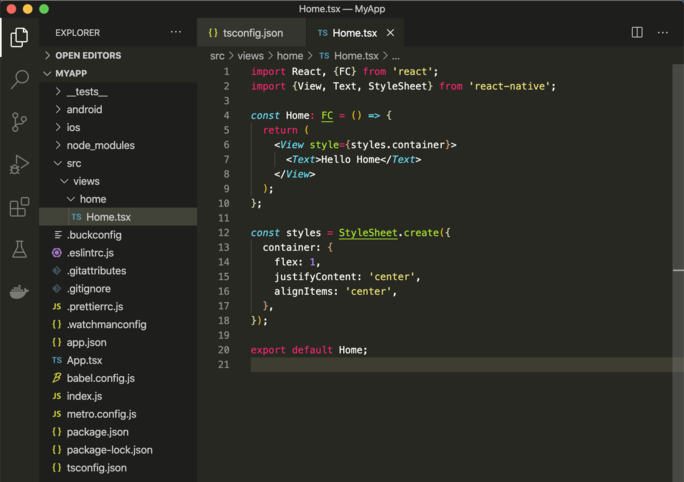
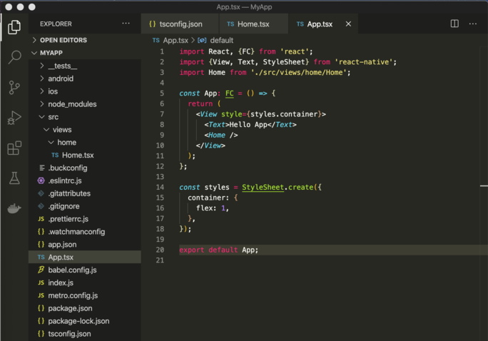
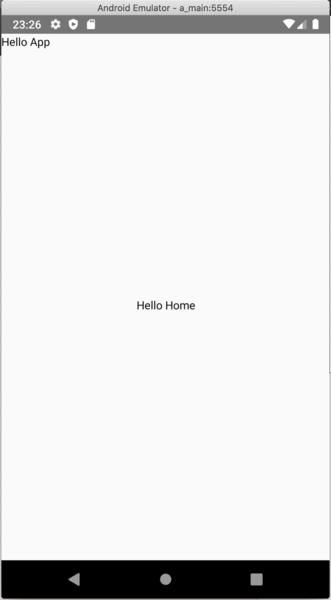
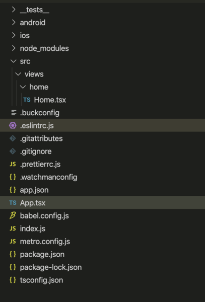
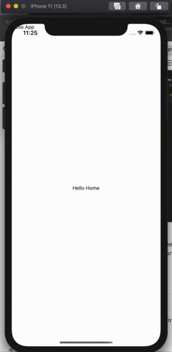

# Part 1: RN CLI setup with TS + Storybook

## Install RN + TS

go to rn docs https://reactnative.dev/docs/typescript and simply grab first line, with react native template. This will save some time on installing all the typescript types for react + renaming all your default files to `.ts`

```
npx react-native init MyApp --template react-native-template-typescript
```

after that is done you can skip `expo install`, you can skip `Ignite install`, go to https://reactnative.dev/docs/typescript#adding-typescript-to-an-existing-project</br>
and **skip 1. step**, you dont need that, since you already installed ts template.</br>
go to step 2. open your `tsconfig.json` file, located in root of your newly created project, delete all content in `tsconfig.json` and replace it with the code from the docs.

_tsconfig.json_

```
{
  "compilerOptions": {
    "allowJs": true,
    "allowSyntheticDefaultImports": true,
    "esModuleInterop": true,
    "isolatedModules": true,
    "jsx": "react",
    "lib": ["es6"],
    "moduleResolution": "node",
    "noEmit": true,
    "strict": true,
    "target": "esnext"
  },
  "exclude": [
    "node_modules",
    "babel.config.js",
    "metro.config.js",
    "jest.config.js"
  ]
}
```

in root , create folder called `src` and in that folder create subfolder `views` and in that folder create another subfolder called `home` and in that create new file `Home.tsx` also here's a cool trick how to do something like that faster</br>

_cool-trick.gif_<br>


in that just create most basic React component. something like this.

_src/views/home/Home.tsx_</br>


Now open `App.tsx` located in root and just delete everything there. and import your Home component and render it. like this

_App.tsx_</br>
<br>

run the app to see if everything is connecting okay.
Here's what we got so far:<br>

|  |            |
| :-------------------------------------------: | :----------------------------------------------------------: |
|  _Your app should look something like this_   | _And your folder structure should look something like this._ |

Time to Add Storybook<br>

## Add Storybook

_this guide is heavily inspired by this blogpost, but i did some minimal changes of my own, i think i just have to leave credit to this person https://sophieau.com/article/react-native-storybook/_

go to storybook docs https://storybook.js.org/docs/guides/guide-react-native/#automatic-setup and grab the first line to install storybook<br>

```
npx -p @storybook/cli sb init --type react_native
```

this will install storybook installer and after that is done you will get prompted to this question:<br>
`Do you want to install dependencies necessary to run storybook server? You can manually do it later by install @storybook/react-native-server (y/N) • Adding storybook support to your "React Native" app`
`

select `no` cause we will be using storybook from our app and will not be launching storbyook server.<br>
Let's test whether it worked.<br>
In your `intex.js` located in root comment out your App component and instead add storybook like this:

_index.js_<br>
<br>

Time to launch app and test if it even runs now. hit your `npm run andriod` or `npm run ios`

_storybook should run successfully_<br>
<br>

So far so good, we know we successfully installed storybook and we can launch it from our app.

Create first basic Component for storybook, in `src` create subfolder `components` and subfolder in that `buttons` and in that `Btn.tsx`

_src/components/buttons/Btn.tsx_<br>
<br>

while we're at it lets create another view in `src/views` create subfolder `login` and create component `Login.tsx`<br>

_src/views/login/Login.tsx_<br>
<br>

time to rename storybook file extensions to '.ts'<br>
rename storybook/index.js => index.ts<br>
delete addons files (we will be using storybook in a very simple way)<br>
rename storybook/stories/index.js => index.tsx<br>
delete folders storybook/stories/Button and storybook/stories/CenterView<br>
and modify content to suit our needs<br>

_storybook/stories/index.tsx_<br>
<br>

now navigate to `storybook/stories/Welcome` and delete default component , instead we will add our own very basic 'welcome to storybook' view, create Welcome.tsx component

_storybook/stories/Welcome/Welcome.tsx_<br>
<br>

so why we did all of this? If you noticed, in storybook/stories/index.tsx we imported our own components, we made previously, straight from the src directory, i find this much more easier just to simply import your components instead of tinkering with storybook code and copy pasting duplicates etc... And just leave simple Welcome screen in storybook.<br>

lets launch our app again and see if its not completely broken.<br>
..aaand it is!<br>
we need to modify `storybook/index.ts` file<br>

_storybook/index.ts_<br>
<br>

we removed `AppRegistry`, since our storybook will be launching from within our app, it's gonna use AppRegistry declared in `index.js` file ...in other words _'aaaay don' worry bout it!'_<br>
lets run the app again. fingers crossed it should run now<br>

_Storybook should now look something like this_<br>
<br>

from this point you can follow the blogpost which i added in the beginning of this section from step<br>
**3. Run the Storybook UI side by side**<br>
with the app on your device https://sophieau.com/article/react-native-storybook/ or you can stay here, i will not be replicating everything from it. just the main part that i need

install

```
npm install react-native-dev-menu --save-dev
```

this library will let you add custom button in `developer menu`<br>
add this lil' script to your `package.json` scripts

```
"pod-install": "cd ios; pod install; cd ../"
```

_package.json_<br>
<br>

after you installed dev-menu package, you also need to install it to ios dependencies , hence this script will help you out with that and help in future encounters. Run

```
npm run pod-install
```

to execute it.

in `src` create subfolder `root` and component `Root.tsx` and simply copy paste the example from [blog]('https://sophieau.com/article/react-native-storybook/'), im my version only thing you need to do is fix imports

_src/root/Root.tsx_<br>
<br>

What this does? useEffect is listening to toggleStorybook button in developer menu (which we installed previously) and if it is development environment (`__DEV__`) switches the app to storybook and vice versa.

modify `index.js` file so that entry point is This `Root` component instead of `App.tsx` , again, just like in blog example, except fix the Root import.

_index.js_<br>
<br>

Relaunch your app for new node_module to take effect.<br>
you should now be able to open developer menu and there is a new `Toggle Storybook` button which toggles storybook on and off. to open dev menu on IOS press `⌘D` while on active emulator window, on android simply type `d` in active js console. 

_dev menu in action_<br>
<br>

Here's the link to the blog again https://sophieau.com/article/react-native-storybook/ i highly recommend to read it till the end, but for this project we are not going to need context/module/redux wrapper for visual components, since i will try to show you how to separate logic from visuals (concept of _smart and dumb_ components) in future posts.
